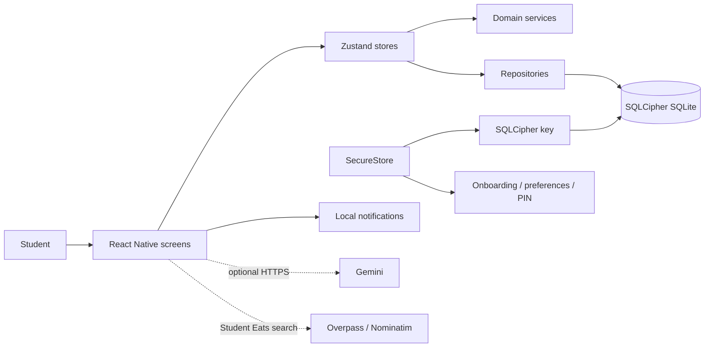

# Architecture and Operations

Updated: 2026-10-03

## Runtime context

## Boundaries and decisions

- Finance values are integer minor units. Domain calculations stay pure where practical.
- Screens depend on store actions and view models; repositories own validation and SQL.
- SQLCipher encryption and optional App Lock solve different problems and use separate key material.
- The app is local-only: it owns no application server, remote user account, server database, or sync API.
- First-run onboarding persists a bounded, versioned SecureStore draft; SQLCipher remains authoritative for
  accounts and transactions. Root navigation chooses one mutually exclusive shell: loading, first-run,
  locked, or main.
- Retry-safe mutations use nullable transaction source keys. Imports derive deterministic keys from local
  content/mapping/row identity; a user-edited prior import is reported as skipped while new rows commit,
  not overwritten or double-posted. Direct conflicting repository mutations fail.
- Recurring occurrence provenance lives on the transaction as a scheduled timestamp, so deleting a template
  does not make a historical occurrence appear manual.
- Student Eats uses a deterministic campus origin. Removing GPS reduces permissions and prevents the UI
  from implying user-relative results.
- Import account resolution is explicit and atomic. It does not silently coerce unknown labels to Cash.

## Environments and configuration

- Supported local baseline: Node 22 LTS, npm 10+, JDK 21, Android SDK/API 35, NDK 27.1.
- Expo Go is unsupported because the app needs the SQLCipher native client.
- `app.config.js` extends Expo's normalized config; `app.json` contains no location permission request.
- Secrets belong in local/EAS secret storage. Never commit `.env`, keystores, database keys, PIN material,
  or Gemini credentials.

## Reliability and observability

QA update (2026-10-03): the schema is version 7. Recurring duplicate checks/posts/schedule advancement share one transaction; goal increments are atomic SQL updates. Budget spending and posted recurring occurrences are indexed once in memory instead of repeatedly scanning the ledger. Restore validates backup fields before replacement, then records the previous state in one single-use recovery slot. Import source keys make retries after a committed-but-unrefreshed result reconcilable. `npm run test:stress -- docs/qa/2026-10-03/stress-final.json` ran an isolated synthetic file-backed SQLite workload: 1,829 operations/zero errors, dashboard p95 8.43 ms and 32-writer p99 2,621.75 ms. This sends no remote traffic and is not HTTP RPS, native SQLCipher, or real concurrent-user evidence. See [Verification and Evaluation](./Verification%20and%20Evaluation.md) for current checks.

- Database migrations and imports run transactionally; foreign keys and a five-second busy timeout are on.
- Recurring catch-up is idempotent for a rule/scheduled timestamp and preserves the monthly anchor day.
- Restore and undo use the same validated transactional replacement path. One recovery snapshot is kept and consumed by undo.
- If an existing PIN is found while its preferences are missing, invalid, or unreadable, startup fails closed
  to the lock shell; PIN unlock restores an enabled lock preference when SecureStore permits.
- UI errors stay in context; success navigation happens only after the store action resolves.
- The app currently relies on local error UI and development logs; there is no remote telemetry service.
  Do not add finance values or secrets to logs.

## Build, release, and rollback

Use `npm ci`, `npm test`, `npx expo-doctor`, Expo export, then a Node 22/JDK 21 native debug build and device
smoke test. Release remains gated by the checklist in [`docs/release-checklist.md`](../docs/release-checklist.md).
Schema migrations 5–7 are additive and have no automated downgrade. Do not release an older build against a
database already upgraded to v7. A production rollout was not performed.

Static/Jest/desktop-SQLite evidence does not establish native acceptance. Android development-build startup,
SQLCipher migration/open/reopen, SecureStore failure recovery, PIN/biometric background locking, notification
delivery, file-picker import, restore/undo, tablet layout, and live Gemini/Overpass/Nominatim behavior remain
**UNVERIFIED** until run on supported devices and providers. Expo Go is not a valid substitute for these checks.

## Repository layout and cleanup

Audit date: 2026-09-28. The repository keeps Expo configuration and entry points at the root; `src/` owns application modules, `assets/` bundled images/SVGs, `plugins/` native config plugins, `__tests__/` Jest checks, `scripts/` build helpers, `docs/` published documentation and screenshot evidence, `AI Skills/` the 15 specialist instructions, and `Project Guidelines/` canonical engineering documentation. `.kilo/` contains agent plans and local session configuration; `.vscode/` and `.idea/` contain development tooling. Ignored `android/`, `.expo/`, `dist/`, `coverage/`, and `node_modules/` contain local/generated state and were not pruned.

### Path change register

| Path | Action and owner | Reason and references | Recovery |
|---|---|---|---|
| Root `AI Documentation Notes.md` -> `Project Guidelines/AI Documentation Notes.md` | Already deleted at root and present untracked at destination before this audit; not moved by this cleanup | Canonical documentation location per `AGENTS.md`; historical notes retained intact and a current navigation map added | Preserve/add the destination before recording a Git rename; original remains in Git history |
| Root `Tech Stack Setup Guide.md` -> `Project Guidelines/Tech Stack Setup Guide.md` | Already deleted at root and present untracked at destination before this audit; not moved by this cleanup | Canonical location; repaired its links to root `index.html` and `docs/screenshots/` | Preserve/add the destination before recording a Git rename; original remains in Git history |
| `README.md`, `docs/index.html`, `index.html` | No file move; corrected two README links, regenerated the published mirror with `npm run build:readme-page`, and repaired the root page's setup-guide URL | Root documentation paths no longer resolve after the pre-existing relocations; the QA pointer now targets `Verification and Evaluation.md` | Re-run `npm run build:readme-page` after README edits |
| `src/screens/fixtures.js` | Candidate only, retained | Deprecated empty export with no imports found; deletion tool failed, so no removal is claimed | Re-evaluate with a working deletion tool and rerun Jest/Expo export |

No application module, asset, schema, migration, service endpoint, or package path was relocated or deleted by this cleanup. The existing root `.nojekyll`, `docs/.nojekyll`, gallery ZIP, environment audits, and agent worktrees were retained because publication targets, distribution, environment evidence, or live session state may depend on them. See [Verification and Evaluation](./Verification%20and%20Evaluation.md#repository-cleanup-audit-2026-09-28) for executed checks and baseline gaps.
