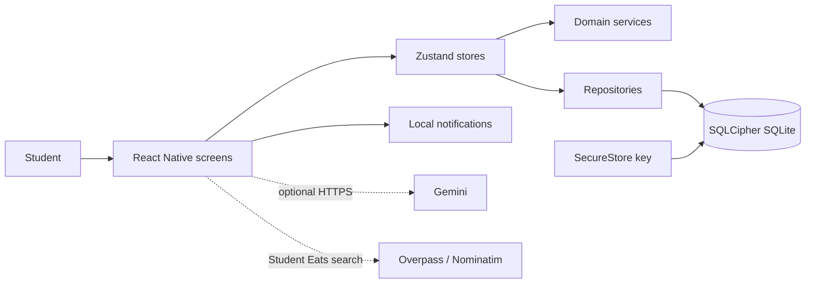

# Architecture and Operations

Updated: 2026-09-27

## Runtime context

## Boundaries and decisions

- Finance values are integer minor units. Domain calculations stay pure where practical.
- Screens depend on store actions and view models; repositories own validation and SQL.
- SQLCipher encryption and optional App Lock solve different problems and use separate key material.
- Student Eats uses a deterministic campus origin. Removing GPS reduces permissions and prevents the UI
  from implying user-relative results.
- Import account resolution is explicit and atomic. It does not silently coerce unknown labels to Cash.

## Environments and configuration

- Supported local baseline: Node 22 LTS, npm 10+, JDK 21, Android SDK/API 35, NDK 27.1.
- Expo Go is unsupported because the app needs the SQLCipher native client.
- `app.config.js` extends Expo's normalized config; `app.json` contains no location permission request.
- Secrets belong in local/EAS secret storage. Never commit `.env`, keystores, database keys, PIN material,
  or Gemini credentials.

## Reliability and observability

- Database migrations and imports run transactionally; foreign keys and a five-second busy timeout are on.
- Recurring catch-up is idempotent for a rule/scheduled timestamp and preserves the monthly anchor day.
- UI errors stay in context; success navigation happens only after the store action resolves.
- The app currently relies on local error UI and development logs; there is no remote telemetry service.
  Do not add finance values or secrets to logs.

## Build, release, and rollback

Use `npm ci`, `npm test`, `npx expo-doctor`, Expo export, then a Node 22/JDK 21 native debug build and device
smoke test. Release remains gated by the checklist in [`docs/release-checklist.md`](../docs/release-checklist.md).
This reconciliation is locally reversible and adds no database migration. A production rollout was not
performed.
