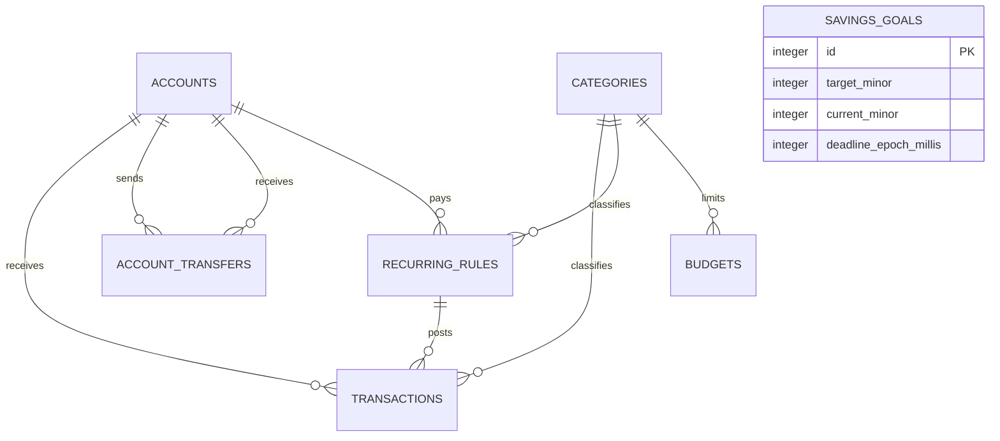

# Database Structure

Updated: 2026-10-07
Engine: SQLite via OP-SQLite with SQLCipher; schema version 8

## Data model

| Entity | Ownership and constraints | Relevant indexes |
|---|---|---|
| `accounts` | Local user data; Cash/Card/E-wallet; archived accounts remain referentially valid | Primary key |
| `categories` | Seeded plus custom; type participates in the transaction/rule foreign key | Unique `(id,type)` |
| `transactions` | Positive integer minor amount, type/category/account, posted epoch, optional recurring rule, optional scheduled epoch, and optional retry-safe source key (1–256 nonblank characters) | Category, account, date, recurring rule; unique nullable `source_key` |
| `account_transfers` | One positive minor-unit movement between two distinct owned accounts; both account references are delete-restricted; optional note and retry-safe source key | From account, to account, descending date; unique nullable `source_key` |
| `recurring_rules` | Positive amount, frequency, next run, optional icon, 14-day default, monthly anchor | Category, account, active/next run |
| `budgets` | One positive limit per category/month | Unique `(category_id,month_year)` |
| `savings_goals` | Positive target, nonnegative current amount, optional deadline, archive flag | Active/deadline |
| `restore_recovery_snapshot` | One bounded pre-restore backup (`id = 1`) stored inside the encrypted database | Primary key constrained to `1` |
| `app_metadata` | Local application lifecycle markers; currently records completion of the one-time default-data bootstrap | Text primary key |

## Schema 5–8 reconciliation

- Migration 5 adds nullable `transactions.source_key` and its unique index. Existing transactions remain
  valid with `NULL`; SQLite permits multiple nulls while enforcing uniqueness for assigned keys.
- File and pasted imports derive `import:v1` keys from a SHA-256 content fingerprint, the selected column
  mapping, and source row number. A retry reconciles an unchanged committed row. If that row was edited
  after import, the import action reports it as skipped and keeps the edit while processing other rows;
  direct repository writes with a conflicting source key fail instead of silently changing money data.
- Migration 6 adds the singleton `restore_recovery_snapshot` and `app_metadata` tables. When upgrading an
  existing database, it marks default bootstrap complete; a fresh installation seeds additional defaults
  once. Refreshes do not recreate items a user archived or deleted, and archived account types are not
  treated as missing even if bootstrap metadata is absent.
- Migration 7 adds `transactions.scheduled_date_epoch_millis` and backfills it from the posted date for rows
  still linked to recurring rules. New recurring occurrences persist the scheduled date independently of
  `recurring_rule_id`; `ON DELETE SET NULL` can therefore remove a rule without erasing occurrence provenance.
- Migration 8 adds `account_transfers`. A transfer is one atomic row—not paired income/expense rows—so it
  adjusts account balances while contributing zero to income, expense, category-budget, and net-worth totals.
  New transfers require two active accounts; historical transfers remain valid if an account is archived.
- Import parsing retains the source account label. Resolution and all account/transaction inserts occur in
  one database transaction. A committed import whose UI refresh fails reports a distinct uncertain-display
  result; retrying the same source keys reconciles rather than double-posting.
- Recurring catch-up de-duplication remains an application invariant for each rule and scheduled timestamp;
  it is not a separate database unique index.
- JSON backup version 3 includes transfers and validates identities, account references, dates, amounts, and
  unique source keys before replacement. Version 2 remains readable and normalizes to an empty transfer list.
  Transaction CSV remains transaction-only by design.

## Lifecycle, privacy, and recovery

### QA integrity corrections (2026-09-28)

Single-statement repository helpers accept both a database and a caller-owned transaction executor. Goal contributions increment atomically in SQL, with a safe-integer overflow guard. Recurring catch-up reads schedules, checks prior posts, inserts, and advances schedules in one serialized transaction, so concurrent callers cannot post duplicate runs or leave partial posts after failure. As of 2026-10-07, only the transaction-scoped executor can join an open transaction; unrelated reads/writes stay queued through commit or rollback.

Restore validates collection shapes, unique source IDs, required references, and safe integer money/timestamps before replacing local data. Unmapped references fail instead of silently skipping rows. Thirty-two concurrent contribution/catch-up checks and rollback/unsafe-backup reproductions pass on real desktop SQLite; native SQLCipher remains unverified. Details and query plans: [QA Verification Report](./QA%20Verification%20Report%202026-09-28.md).

Immediately before a restore replaces finance tables, the current snapshot is serialized into
`restore_recovery_snapshot` in the same transaction. `undoLastRestore` restores and consumes that slot
atomically: a second undo cannot silently reapply the replacement. Later edits made after restore are
replaced by undo, as disclosed in its confirmation copy. This is local recovery, not backup history or
cross-device sync; at-rest encryption on the native target still needs device verification.

- SQLCipher keys are generated separately from App Lock PIN material and stored through SecureStore.
- PIN replacement never migrates or rekeys SQLCipher. Destructive local reset is the only forgotten-PIN
  fallback without native verification: it clears cached finance state, checkpoints/deletes the internal
  database before its key, and uses a persisted pending marker so startup can finish an interrupted reset.
  User-exported backup files outside the app sandbox are not deleted.
- Android automatic backup is disabled; explicit app backup/export is the supported recovery path.
- Foreign keys, `STRICT` tables, WAL, `synchronous=FULL`, and `foreign_key_check` protect local integrity.
- There is no remote database. Import files and exports are user-selected local/share artifacts.

Schema 5–8 upgrades are forward, additive migrations. There is no automated downgrade path; rolling back to
an older app build after migration is unsafe because that build does not understand the v8 contract. Native
device migration, SQLCipher open/reopen, restore/undo, and backup round-trip acceptance remain **UNVERIFIED**
until exercised in a development build on supported Android hardware or an emulator.
