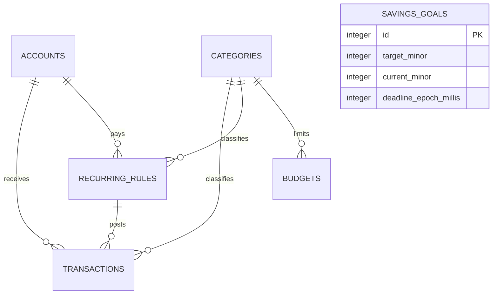

# Database Structure

Updated: 2026-09-27  
Engine: SQLite via OP-SQLite with SQLCipher; schema version 4

## Data model

| Entity | Ownership and constraints | Relevant indexes |
|---|---|---|
| `accounts` | Local user data; Cash/Card/E-wallet; archived accounts remain referentially valid | Primary key |
| `categories` | Seeded plus custom; type participates in the transaction/rule foreign key | Unique `(id,type)` |
| `transactions` | Positive integer minor amount, type/category/account, epoch, optional recurring rule | Category, account, date, recurring rule |
| `recurring_rules` | Positive amount, frequency, next run, optional icon, 14-day default, monthly anchor | Category, account, active/next run |
| `budgets` | One positive limit per category/month | Unique `(category_id,month_year)` |
| `savings_goals` | Positive target, nonnegative current amount, optional deadline, archive flag | Active/deadline |

## Reconciliation effects

- No schema version or existing record ID changed.
- Fresh databases now default `recurring_rules.reminder_lead_days` to 14. Existing values are preserved;
  no migration overwrites user data.
- Import parsing retains the source account label. Resolution occurs before the transaction starts, then
  named accounts and all transaction rows are created inside one database transaction.
- Recurring de-duplication uses the scheduled `(recurring_rule_id, date_epoch_millis)` pair. It is an
  application invariant rather than a database unique index.

## Lifecycle, privacy, and recovery

- SQLCipher keys are generated separately from App Lock PIN material and stored through SecureStore.
- Android automatic backup is disabled; explicit app backup/export is the supported recovery path.
- Foreign keys, `STRICT` tables, WAL, `synchronous=FULL`, and `foreign_key_check` protect local integrity.
- There is no remote database. Import files and exports are user-selected local/share artifacts.

Rollback for this reconciliation is code-only because no migration was introduced. Reverting the changed
source restores prior behavior without transforming persisted rows.
