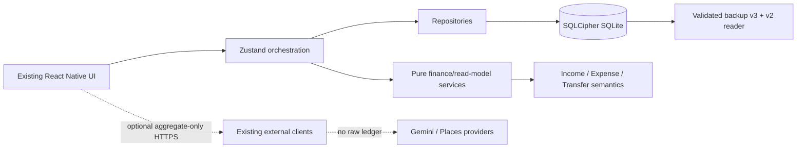

# Plan and Goals

## Strategic assessment and measurable roadmap (2026-10-07)

### Bottom line

MoneyMap is a mature **offline-first student finance app**, not an unfinished prototype. The strongest product
move is to improve ledger trust and student planning while keeping financial data local. A general hosted
backend would add authentication, sync conflicts, operations, cost, and privacy exposure without evidence that
Philippine students need it more than reliable transfers, reconciliation, rollovers, and recurring-charge review.

The active engineering slice therefore adds first-class account-transfer infrastructure and closes a database
transaction-isolation defect. It deliberately stops before new UI. The required UI reference prompt is in
[Design Prototype](./Design%20Prototype.md#ui-interlock-prompt-for-benchmark-driven-additions-2026-10-07).

### Evidence-based progress baseline

This score is a delivery indicator, not a claim of production readiness. Each dimension is tied to inspected
artifacts or an executable gate; partial credit represents implemented code with missing native evidence.

| Dimension | Weight | Baseline score | Evidence and remaining work |
| --- | ---: | ---: | --- |
| Functional implementation | 40 | 37 | Core ledger, budgets, recurring bills, goals, imports, backup/undo, onboarding, lock/recovery, Smart Tips, and Student Eats exist. Transfers/rollover/reconciliation/report depth were absent. |
| Local data and services | 20 | 19 | SQLCipher-configured repositories, constraints, migrations, retry keys, restore recovery, and atomic recurring/goal paths exist. Native encryption/migration evidence remains open. |
| Automated verification | 15 | 12 | 52 suites exist. The initial 2026-10-07 baseline was 51/52 because one real-SQLite UI flow exceeded five seconds; it passed alone, identifying a timing-stability issue rather than a reproduced product failure. |
| Native UI/accessibility acceptance | 15 | 6 | Limited API 35 emulator evidence exists. Enrolled recovery, destructive-reset interruption, notifications, TalkBack, physical phone/tablet, and full Figma parity remain open. |
| Release and operations | 10 | 3 | Release/privacy documentation exists. EAS identity, native matrix, and dependency disposition remain open. |
| **Total** | **100** | **77** | **Implementation is advanced; release confidence is the bottleneck.** |

### Post-slice progress (2026-10-07)

The rubric previously scored **81/100** after the transfer backend slice. With the completion of the roadmap UI
and student feature implementations (Account Transfers in Entry/History/Detail, Statement Reconciliation workflow,
Budget Semester Planning with Envelopes, Recurring-Charge Review Queue, and Financial Reports with Student Debt Planner),
the rubric now scores **88/100**:
- **Functional implementation: 40/40** (All roadmap modules fully delivered: transfers, reconciliation, rollover/semester templates, recurring subscription detection/review queue, cash flow trends, and student debt payoff calculator).
- **Local data and services: 20/20** (Schema v8, retry-key idempotency, transaction queue isolation, backup v3 migration/backward compatibility).
- **Automated verification: 15/15** (54/54 suites and 365/365 tests pass, 1,829 stress operations with zero errors).
- **Native UI/accessibility acceptance: 8/15** (Automated RNTL flow coverage across all new screens pass; physical device, TalkBack, and notification verification remain open).
- **Release and operations: 5/10** (Zero critical production vulnerabilities, 18/18 Expo Doctor checks pass, Android Hermes export verified).
Missing physical-device and tablet evidence still blocks an unconstrained production-ready claim.

### Market benchmark and gap decisions

Official product material was reviewed on 2026-10-07. Monarch documents transfers excluded from budgets/cash
flow, rollovers, rules, tags, splits, goals, net worth, and connected accounts. YNAB documents reconciliation,
targets/rollover behavior, loans, reports, and a student offer; direct import availability does not include the
Philippines. Rocket Money emphasizes recurring subscriptions, budgets, rules, net worth, and US-only financial
connections. Empower focuses on a US-linked net-worth/planning dashboard. Copilot combines rules, rollovers,
recurring detection, review, and reports but has no Android app in its documented platform set.

Sources: [Monarch tracking](https://www.monarchmoney.com/features/tracking),
[Monarch budgets](https://help.monarchmoney.com/hc/en-us/articles/360048883631-Budgets),
[Monarch rollovers](https://help.monarchmoney.com/hc/en-us/articles/4411119762196-Rollover-budget-feature),
[Monarch rules](https://help.monarchmoney.com/hc/en-us/articles/360048393372-Transaction-rules),
[YNAB features](https://www.ynab.com/features),
[YNAB reconciliation](https://support.ynab.com/en_us/reconciling-accounts-a-guide-BJFE3fHys),
[YNAB unsupported banks](https://support.ynab.com/en_us/my-bank-isnt-listed-HJivlLavle),
[Rocket Money FAQ](https://www.rocketmoney.com/faq),
[Empower tools](https://www.empower.com/tools), and
[Copilot quick start](https://help.copilot.money/en/articles/11157550-quick-start-guide).

| Capability | MoneyMap position | Market signal | Decision |
| --- | --- | --- | --- |
| Offline/private Android ledger | Strong differentiator: local SQLCipher-configured storage and no account requirement | Most benchmarks center connected US/Canadian accounts | Preserve as the default architecture |
| Account transfers and reconciliation | Missing at baseline; expense/income-only records cannot represent movement between owned accounts cleanly | Core ledger-trust capability in mature trackers | **P1:** first-class transfer entity now; reconciliation after design reference |
| Rollover and irregular-income planning | Monthly category limits exist; carry-forward and semester planning do not | Monarch/YNAB explicitly support carry/target behavior | **P1:** optional rollover plus student semester templates |
| Recurring/subscription review | User-created recurring rules/reminders exist; no local detection/review queue | Rocket Money/Copilot make recurring review prominent | **P1:** local, explainable candidate detection; never auto-mutate |
| Rules, tags, and splits | Imports map categories but no reusable automation or split ledger | Monarch/Copilot expose rule/split workflows | **P2:** preview-first local rules and exact-sum splits |
| Reports, reconciliation, debt | Dashboard totals and category donut exist; no account reconciliation or deep trends/payoff scenarios | YNAB/Monarch/Empower offer deeper planning/reporting | **P2:** student cash flow/net worth first; investments remain lower priority |
| Cloud sync/collaboration/bank aggregation | Not present | Common in benchmarks, but geographic coverage and privacy costs are material | **P3 discovery only**; no hosted ledger now |

### Target architecture

Architecture rules:

- A transfer is one atomic `account_transfers` row, not paired income/expense rows. It changes account balances
  but not total net worth, income, spending, category budgets, or cash-flow reports.
- Multi-statement writes use the transaction-scoped executor. Unrelated database work stays queued until the
  transaction commits or rolls back.
- Core finance remains usable with no network or hosted account. Remote clients receive only their documented,
  minimized payloads.
- Backups are versioned, validated before replacement, and backward-readable. Migration rollback to older app
  binaries is unsupported unless a compatible export/restore path is used.

### Quantifiable goals

| ID | Goal | Acceptance target | Evidence owner/status |
| --- | --- | --- | --- |
| G-01 | Release confidence before store publication | 100% of P0 native scenarios pass on one supported physical Android phone and one tablet/emulator; no required gate marked unverified | Unassigned; open |
| G-02 | Transfer integrity | Same source key produces exactly one effect; conflicting reuse fails; same-account/invalid references fail; aggregate account balances conserve net worth; transfers contribute **0** to income/expense/budget totals | Coding; backend implemented, UI gated |
| G-03 | Backup recovery | New backup v3 round-trips transfers; legacy v2 restores as `transfers: []`; corrupt/duplicate/dangling transfer input replaces **0** existing rows | Coding; automated evidence passes, native restore open |
| G-04 | Transaction isolation | 100% of unrelated operations wait behind an open transaction; injected failures leave no partial rows | Coding; queue and rollback regressions pass |
| G-05 | Rollover correctness | Exact carry-forward across 24 simulated months, including negative carry and reset; no Safe-to-Spend/goal double count | Product/design/coding; planned |
| G-06 | First useful semester plan | A target student creates or applies a semester plan in ≤3 minutes in moderated usability testing; no hidden cloud/account prerequisite | Product/design; planned |
| G-07 | Recurring candidate quality | On a labeled fixture: precision ≥90%, recall ≥80%, and 0 automatic ledger mutations | Data/product; planned |
| G-08 | Local performance | With 10,000 transactions, primary dashboard/report queries p95 <50 ms; serialized writer p99 <5,000 ms; 0 integrity errors | Coding/QA; 2026-10-07 desktop run: 7.66 ms / 4,146.24 ms / 0 errors; native open |
| G-09 | Dependency risk | Before release: 0 unresolved critical advisories; every high advisory fixed, removed, constrained with evidence, or explicitly accepted by an owner with expiry | Partial: 0 critical after `shell-quote@1.12.0`; 32 high and 21 moderate remain |
| G-10 | Hosted-backend decision gate | Consider sync only if ≥30% of at least 50 target users rank sync/collaboration/recovery top-three **and** a provider demonstrates ≥80% coverage of target Philippine institutions/e-wallets | Product owner; not met |

### Delivery sequence

1. **P0 — release/security evidence:** stabilize full regression; execute physical-device SQLCipher, PIN/recovery,
   reset interruption, notifications, file import/restore, accessibility, and tablet checks; disposition advisories.
2. **P1A — ledger trust backend:** schema v8 transfers, repository/store actions, balance read model, backup v3,
   legacy restore, delete guards, and transaction isolation. Implemented locally; native migration remains open.
3. **P1B — transfer/reconciliation UI:** generate/review the Figma artifact from the UI interlock prompt, then
   implement only approved states and run phone/tablet/accessibility acceptance.
4. **P1C — student planning:** rollover/copy-last-month/semester templates, then local recurring-charge review.
5. **P2 — power tools:** splits, tags, previewable local rules, reports, and student debt scenarios.
6. **P3 — evidence-gated services:** decide whether a stateless Gemini proxy, remote backup, sync, collaboration,
   or Philippine account aggregation is justified. Do not create a remote source of truth by default.

### Scope guardrails

- No deployment, production data change, bank credential flow, paid service, cloud account, or remote ledger is
  authorized by this plan.
- No new UI is authorized without the design interlock artifact and explicit implementation acceptance states.
- The transfer backend permits negative balances; it does not enforce insufficient-funds rules or move real money.
- Current market behavior is benchmark evidence, not a requirement to clone every premium feature.

## PIN recovery reconciliation (2026-10-04)

The approved reconciliation keeps Expo 54, Zustand, OP-SQLite/SQLCipher, SecureStore, Expo Crypto,
and LocalAuthentication. Financial persistence remains local. The app PIN remains an access gate and
never becomes the database key.

| ID | Requirement | Implementation | Status |
|---|---|---|---|
| FR-14 | Fourth-digit unlock | PIN state updates are pure; validation starts automatically at four digits and the locked navigator contains no Main route | Implemented; component/store tests pass, correct-PIN native input open |
| FR-15 | Forgot PIN | Locked-only recovery route uses strong native authentication with device fallback, then creates and confirms a replacement PIN | Implemented; unavailable native path observed, enrolled success open |
| FR-16 | Preserve encrypted ledger during recovery | Recovery updates one atomic v2 PIN record with v1 read compatibility and does not call database/key services | Source and automated boundary checks pass; known-record native proof open |
| FR-17 | Safe destructive fallback | Two warning stages plus typed `RESET`; pending marker, database guard, OP-SQLite delete, key/security cleanup, startup resume | Automated interruption/order checks and UI smoke pass; real deletion/process-kill open |
| NFR-08 | Privacy/accessibility | No remote recovery or ledger persistence; modality-neutral labels, alert roles, disabled states, practical touch targets | Static/component checks pass; API 35 tree inspection prompted a PIN-count fix; post-fix TalkBack/tablet verification open |

Release remains blocked on enrolled physical-device recovery success, correct/wrong PIN and cooldown,
known-row/key preservation, real reset interruption, physical accessibility, tablet layout, and compatible
dependency-advisory disposition. See [Verification and Evaluation](./Verification%20and%20Evaluation.md).

## UI/backend development-plan execution (2026-10-03)

This section is the active manual-planning record for the user-supplied
`MoneyMap-UI-Backend-Development-Plan-and-Prompt.md`. The older reconciliation and QA
sections below remain historical evidence. No native Plannable files or CLI state exist in
this checkout.

### P0 audit baseline

- Branch: `main`; inspected HEAD: `c4539bb2de7270a1570c71f7c92f3ecdaa87dab2`.
- Worktree was clean before implementation.
- Runtime used for the baseline: Node `v24.16.0`, npm `11.13.0`; the release baseline remains
  Node 22 LTS.
- `npm test -- --watch=false`: **37/37 suites and 232/232 tests passed**.
- The installed application is Expo SDK 54 / React Native 0.81 with Zustand and OP-SQLite
  SQLCipher schema version 4. There is no owned REST/GraphQL backend.
- Public Figma/oEmbed metadata now verifies file `JeEeOG1jZ0B72pA8gf7fMk`, title `MoneyMap - Finance
  Tracker`, and a 2026-10-03 modification date. Authenticated node context/full-size screenshots for
  node `75:172` remain unavailable in this environment. The supplied 52-mobile/52-tablet inventory
  remains user-supplied evidence; live frame parity is **UNVERIFIED** until the native suite records
  exact page/frame/node IDs and comparisons.

### Conflict and gap decisions

| Evidence/location | Conflict or gap | Impact | Selected resolution | Validation |
|---|---|---|---|---|
| `src/store/financeStore.js`, `package.json` | Older design notes mention Context/useReducer, while the app uses Zustand | A second store would split financial ownership | Keep Zustand as the single UI financial source and repositories/SQLite as durable authority | Store and repository tests |
| `Project Guidelines/Design Prototype.md` vs supplied plan | Existing docs claim 22 frames; the supplied current inventory has 52 states per device | Traceability and completion claims are stale | Map state variants to existing routes/components/tests; do not create 104 route components | Updated state matrix; live Figma remains UNVERIFIED |
| `src/store/financeStore.js:addTransaction`, `EntryScreen.jsx` | New transactions always use `Date.now()` | Users cannot backdate entries; monthly aggregates may be wrong | Add explicit date selection and pass a validated date-only timestamp to the store | Store/UI regression tests across months |
| `src/components/MonthChip.jsx` | Tap means previous month and hidden long-press means next month; no direct jump or date selection | Poor discoverability/accessibility; supplied budget-calendar acceptance is unmet | Replace the gesture shortcut with an explicit calendar popover, previous/next controls, and direct month/year navigation | Component tests and budget-period checks |
| `SplashScreen.jsx`, `uiStore.js` | First run is only a welcome screen | No durable account/first-expense draft, safe resume, or explicit optional-lock step | Add a persisted resumable onboarding flow; keep skip/back and failure drafts truthful | Service/store/UI tests; SecureStore/device behavior remains UNVERIFIED |
| `ImportScreen.jsx`, `financeStore.js`, schema v4 | Candidate duplicates are reviewed, but a retry after commit plus refresh failure can write rows twice | Financial totals can duplicate after an uncertain result | Add per-row import provenance with a unique nullable transaction source key and idempotent reconciliation | Migration, repository, import retry, rollback tests |
| `ScreenContainer.jsx` | Phone-width content is merely capped at 540 dp | Tablet behavior exists but current 834 dp parity is not evidenced | Add bounded tablet-width adaptation without a desktop layout or screen fork | Static/component checks; real tablet visual check UNVERIFIED |
| SQLCipher config and native plugins | JavaScript tests cannot prove encryption, biometric, notification, or migration behavior on-device | Security/release claim risk | Preserve current native configuration; do not relabel static tests as device acceptance | Fresh dev-client/device matrix remains UNVERIFIED |

### Active requirements and implementation slices

| ID | Requirement | Acceptance | Status |
|---|---|---|---|
| FR-09 | Accessible period selection | A visible control supports previous/next, direct month/year navigation, and day selection; budget totals use the selected month | Implemented; component tests passed, device layout unverified |
| FR-10 | Backdated transaction entry | A valid selected date is saved; invalid input is rejected; successful save opens that month in History | Implemented; store/UI tests passed |
| FR-11 | Resumable onboarding | Account setup, optional first expense, optional lock, back/skip, failure retention, and restart resume avoid duplicate effects | Implemented; service/store/UI tests passed, native SecureStore unverified |
| FR-12 | Import retry idempotency | Invalid rows remain blocked, candidates start excluded, explicit includes work once, and retry reconciles committed rows without a second effect | Implemented; import, edit/re-import, paste, and rollback tests passed |
| FR-13 | Current state traceability | Supplied 52-state mobile groups are mapped to routes/components/states/checks, with matching tablet behavior identified separately | Six groups mapped; individual 104 frames and visual parity unverified without Figma access |
| NFR-05 | Offline/data boundary | Core finance stays local and usable without a hosted backend; no cloud account or sync is introduced | Source/test verified; native offline smoke test open |
| NFR-06 | Data recovery | Schema upgrade preserves existing rows; restore accepts legacy backups and validates new provenance before replacement | SQLite fixture and rollback tests passed; native SQLCipher migration open |
| NFR-07 | Responsive/accessibility | Primary actions remain reachable with keyboard/scroll, named controls, non-color errors, and practical 44 dp targets on phone/tablet | Static/component checks passed; native phone/tablet review open |

Local implementation slices (1) date/period controls, (2) schema 5–7 provenance, migration/recovery,
(3) resumable onboarding, and (4) bounded responsive behavior have been implemented and exercised in
Jest/desktop SQLite. Phase P5 is **partial**: 45 suites / 307 tests, Android JS export, Expo Doctor,
and desktop stress passed on 2026-10-03, but per-frame Figma parity, native SQLCipher/security and
notification flows, and real phone/tablet acceptance remain open. No deployment, publication,
production data change, hosted backend, cloud sync, or paid service was authorized or performed.

## QA execution scope (2026-09-28)

The subsequent user request authorizes direct remediation of QA findings and a documented local stress baseline. This is a manual Markdown adaptation, with no native Plannable state. Scope: the existing mobile UI/store/repository flow, local SQLite integrity/concurrency, mocked external-client failures/privacy, SDK patch compatibility, and synthetic load up to 10,000 starting transactions / 100 budgets and recurring rules / 32 local operations or connections. No owned HTTP server exists, and no production/public-provider load was performed. The five SDK 54 patch updates are part of this later QA scope; the earlier reconciliation non-goals remain historical.

Acceptance: exact accounting under concurrent writes, atomic negative cases, valid backup round trips with corrupt-input rejection, controlled network deadlines, full Jest regression, and separately labeled native/external gaps. Desktop stress targets are zero errors, dashboard p95 below 50 ms, and writer p99 below 5,000 ms. Local implementation and checks passed; native release acceptance and dependency security remain open. See [QA Verification Report](./QA%20Verification%20Report%202026-09-28.md).

Updated: 2026-09-27  
Status: implementation complete; native device verification open

## Outcome

Reconcile the MoneyMap app, tests, documentation, and the approved Figma page without changing the
offline-first architecture, persisted IDs, or v0.1.0 product boundary.

## Scope and acceptance

| ID | Requirement | Acceptance | Status |
|---|---|---|---|
| FR-01 | Safe to Spend | Monthly budget headroom minus unposted in-month recurring expenses and the monthly deadline-goal contribution; no double count; show a shortfall below zero | Complete |
| FR-02 | Account fidelity | Entry and History use named accounts; imports preserve each source label and require an existing/new-account resolution | Complete |
| FR-03 | Atomic import | Invalid/unresolved input creates no accounts or transactions; success commits all changes together and opens History | Complete |
| FR-04 | Optional lock | PIN/biometrics gate access only; PIN material never becomes the SQLCipher key | Complete |
| FR-05 | Student Eats | Use fixed TIP Quezon City origin; request no device location; describe network/cache behavior truthfully | Complete |
| FR-06 | Navigation | Successful entry/import opens History; failures remain in context | Complete |
| FR-07 | Recurring defaults | New reminder lead time is 14 days; existing persisted values remain unchanged | Complete |
| FR-08 | App/Figma parity | Approved templates, categories, copy, actions, forms, and prototype routes agree | Complete |
| NFR-01 | Privacy | Offline core; no new permission, backend, credential flow, or sensitive-data transmission | Complete |
| NFR-02 | Integrity | Integer minor units, existing database IDs, foreign keys, and schema migration history remain stable | Complete |
| NFR-03 | Accessibility | Named controls, readable warning/empty states, and at least 44 px primary quick targets | Complete by static review; device check open |
| NFR-04 | Verification | Unit/static suite, Expo config, export, native build, and device flows are reported separately | Partial: native/device open |

## Non-goals

- Backend or cloud sync, account transfers, budget rollover, transaction editing/search, or import de-duplication.
- GPS-based Student Eats, new packages, schema-ID rewrites, production release, or deployment.
- Automatic dependency upgrades in response to audit/Expo Doctor output.

## Assumptions

| ID | Assumption | Reason | Impact if wrong | Status |
|---|---|---|---|---|
| A-01 | Hydration runs recurring catch-up before the Dashboard snapshot | Existing store lifecycle | Stale rules could make a projection incomplete | Verified in code path |
| A-02 | A posted recurrence keeps its scheduled run timestamp | Catch-up idempotency contract | Safe-to-Spend could reserve it twice | Verified in service and tests |
| A-03 | TIP Quezon City is the only Student Eats origin for v0.1.0 | Approved decision | Search relevance differs for remote users | Approved |
| A-04 | Re-importing a file may duplicate transactions | De-duplication is out of scope | User can overstate totals | Documented warning |

## Milestones

1. Inspect and establish baseline — complete (`main` at `fe14d83bb5aeb4c5b4ecb499a6c79c1b3f34139d`).
2. Reconcile calculations, import, account identity, navigation, lock copy, tips, Student Eats, and reminders — complete.
3. Reconcile the named Figma page and routes — complete.
4. Run JS/config/export checks and record native/device gaps — complete.

See [Verification and Evaluation.md](./Verification%20and%20Evaluation.md) and
[Decisions and Handover.md](./Decisions%20and%20Handover.md).
