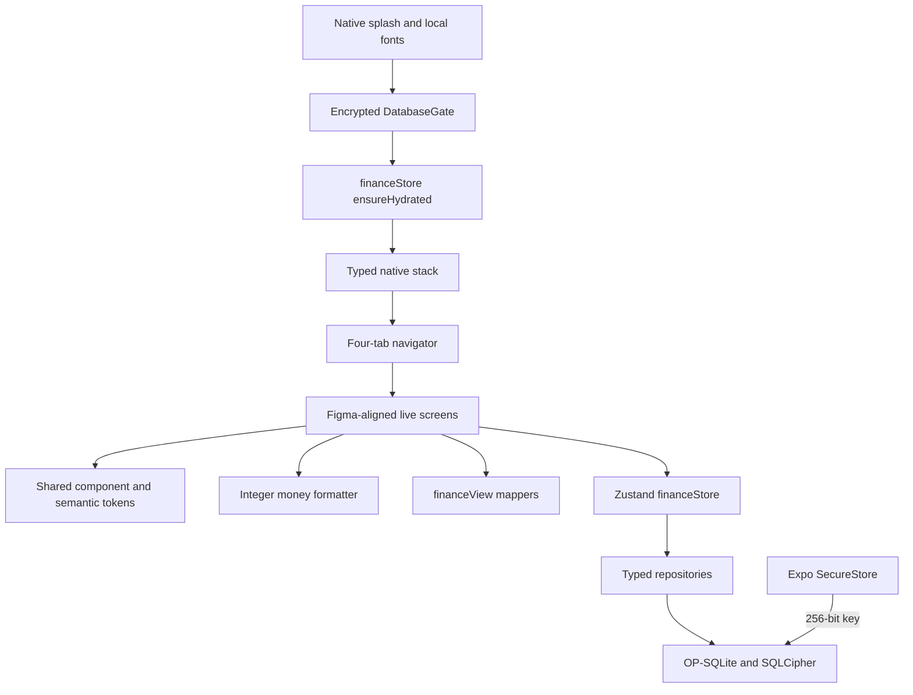
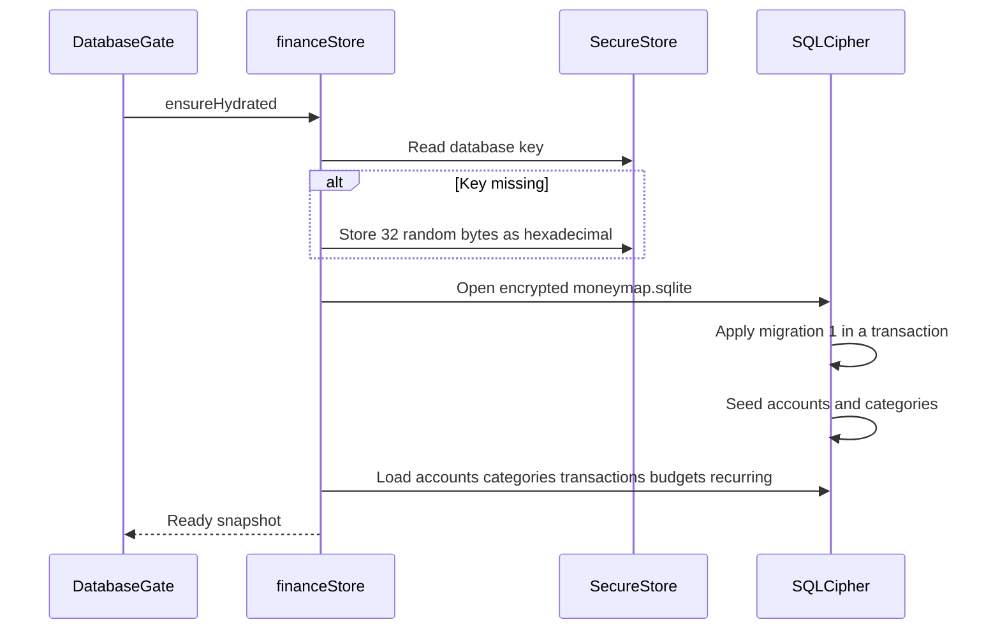

# MoneyMap Tech Stack Setup Guide

## Supported baseline

| Layer | Technology | Version constraint | Purpose |
|---|---|---:|---|
| Runtime | Node.js | 22 LTS (verified `v22.23.2`) | JavaScript tooling and Expo CLI |
| Language | JavaScript (JSX) | ES modules / CommonJS mix per Metro | Application source after TS→JS migration; no `typecheck` script |
| Framework | Expo / React Native | Expo `~54.0.0`, RN `0.81.5` | Android dev build and cross-platform UI |
| Build configuration | Expo Build Properties | `~1.0.9` | Enforce the Android API 26 minimum |
| Native path safety | Local Expo config plugin / CMake | Temp staging + object limit `250` | Shorten generated target directories and hash excess object paths before Windows Ninja reaches `MAX_PATH` |
| SQLCipher runtime packaging | Local Expo config plugin / OpenSSL Prefab | OpenSSL `3.3.2-1` | Extract each ABI's `libcrypto.so` before Android merges JNI libraries |
| UI | NativeWind / Tailwind CSS | NativeWind `^4.2.1`, Tailwind `^3.4.17` | Token-based styling and dark mode |
| UI runtime peers | CSS Interop / Reanimated / Worklets | `0.2.6` / `~4.1.1` / `0.5.1` | NativeWind JSX runtime and Expo-compatible animation worklets |
| Design assets and charts | React Native SVG / SVG Transformer | `15.12.1` / `^1.5.3` | Render the exact Figma tab exports and the dashboard donut locally |
| Deterministic asset generation | Sharp | `0.35.3` development-only | Rasterize the exact Home SVG geometry into the Expo splash PNG |
| Typography and launch | Expo Font / Roboto / Splash Screen | `~14.0.12` / `^0.4.3` / `~31.0.13` | Bundle three approved font weights and hold the native surface until they load |
| Navigation | React Navigation | 7.x | Typed native stack and bottom tabs |
| Visual state | Zustand | `^5.0.14` | Lightweight in-memory preview switches; persistent settings arrive in task 3 |
| Encrypted database | OP-SQLite / SQLCipher | OP-SQLite `^17.1.3` with `sqlcipher: true` | Offline relational storage encrypted at rest |
| Key generation/storage | Expo Crypto / SecureStore | `~15.0.9` / `~15.0.8` | Generate a 256-bit key and protect it with Android Keystore |
| Tests | Jest Expo / RNTL / better-sqlite3 | `~54.0.17` / `^14.0.1` / `^12.11.1` | Test SQL contracts, integer money, themes, and accessible UI states |
| Package manager | npm | 10 or newer (verified `10.9.8`) | Dependency installation and scripts |
| Android tooling | Android SDK cmdline-tools / Studio, JDK | SDK platform 35, build-tools 35, NDK 27.1, Emulator, JDK 21 | API 26+ emulator/device builds; Java 25+ is unsupported by this Gradle stack |

Later functional milestones add notification, file-import, biometric, MMKV, and Smart Tips networking libraries only when their dependencies in the project plan are complete. The current Smart Tips view is an offline visual fixture.

## Architecture visualization



## Development-build flow

```text
TypeScript + semantic tokens + SVG assets
          |
          v
  Babel / Metro / NativeWind
          |
          v
 Expo Android prebuild ----> Gradle + Android SDK ----> Dev-client APK
          |                         |
          |                         +----> package libcrypto.so for SQLCipher
          +----> apply idempotent native config plugins
```

## First-launch database flow



## Before starting on any operating system

1. Install Git, Node.js 22 LTS, npm, JDK 21, and the Android SDK (Android Studio or command-line tools). Do not use Java 25+ with this Expo SDK 54/Gradle build.
2. Install Android SDK Platform 35, Build-Tools 35, Platform-Tools, NDK 27.1.12297006, CMake 3.22.1, Emulator, and `system-images;android-35;google_apis;x86_64`. Create AVD `MoneyMap_VSCode_API_35` (Pixel 6 / Google APIs x86_64).
3. Clone the repository and enter its directory.
4. Copy `.env.example` to `.env`. Leave the key blank: the current Smart Tips screen is offline-only and never reads it.
5. Run `npm ci` (preferred with lockfile) or `npm install`.
6. Run `npm run asset:splash` only after changing the source Home SVG or launch color; identical input produces an identical PNG hash.
7. Run `npm test`; all persistence, money, theme, component, accessibility, and native-plugin tests must pass (44 tests expected).
8. Run `npx expo-doctor` (18/18 checks) and optionally `npx expo export --platform android --clear`.
9. Start an emulator or connect an Android device with USB debugging, then run `npm run android` (first run performs a native dev-client build).

This project requires an Expo development build. Expo Go cannot load OP-SQLite or SQLCipher.

There is no `npm run typecheck` script: application sources are JavaScript/JSX under Metro.

## macOS

1. Install prerequisites with Homebrew where appropriate: `brew install node@22 openjdk@21`.
2. Install Android Studio, then set `JAVA_HOME` to the JDK 21 installation and `ANDROID_HOME` to `$HOME/Library/Android/sdk`.
3. Add `$ANDROID_HOME/emulator` and `$ANDROID_HOME/platform-tools` to `PATH`.
4. Follow the shared install and Android launch steps above. iOS is intentionally outside v1 scope.

## Windows

1. Install Node.js 22 LTS, a JDK 21 distribution, Git, Visual Studio Code, and the Android SDK. Android Studio may supply the SDK and Device Manager, but it does not need to remain open while developing.
2. In Android SDK Manager, install Platform Tools, Android Emulator, Android 15/API 35, and `system-images;android-35;google_apis;x86_64`.
3. Enable Intel VT-x or AMD-V in firmware and **Windows Hypervisor Platform**, then reboot if Windows requests it. Verify with `emulator.exe -accel-check`.
4. Create an API 35 Google APIs x86_64 Pixel AVD named `MoneyMap_VSCode_API_35`. The command-line equivalent is `avdmanager create avd --name MoneyMap_VSCode_API_35 --package "system-images;android-35;google_apis;x86_64" --device pixel_6`.
5. Install the Microsoft **React Native Tools** extension (`msjsdiag.vscode-react-native`). This workspace recommends it automatically.
6. Open the repository in VS Code and press `Ctrl+Shift+B`. The default **MoneyMap: Run on Android emulator** task discovers the SDK/JDK, opens the official emulator, waits for Android, starts Metro, builds, installs, and launches the app.
7. The emulator is a native Google Emulator window beside VS Code. VS Code controls its lifecycle, build, logs, and Hermes debugger through `.vscode`; BlueStacks is neither required nor selected.

This verified workstation uses Android Emulator 35.6.11 with `MoneyMap_VSCode_API_35` because newer 36.6.11/37.1.11 binaries stall during WHPX virtual-CPU startup on its Windows 10/i7 configuration. The compatible Google archive build lives outside the SDK at `%LOCALAPPDATA%\MoneyMap\android-emulator\35.6.11`; `scripts/android-emulator.ps1` prefers it and falls back to the SDK-managed emulator on compatible machines. The published archive SHA-256 used for verification is `0865071aecf3d90a5b967cb6cb0cd48bea0a58a26ef4953b32037671c129b7e9`.

## Linux

Verified on **Linux Mint 22.3 (Ubuntu 24.04 base)** without `sudo` for toolchains (user-space installs):

1. **Node.js 22 LTS** via nvm:
   ```bash
   curl -fsSL https://raw.githubusercontent.com/nvm-sh/nvm/v0.40.3/install.sh | bash
   . "$HOME/.nvm/nvm.sh"
   nvm install 22
   nvm alias default 22
   ```
2. **JDK 21 (Temurin)** user-space (avoid system Java 25/26 EA for Gradle):
   ```bash
   mkdir -p "$HOME/.local/share/MoneyMap/toolchains/temurin-21"
   curl -fL -o /tmp/temurin21.tar.gz \
     "https://api.adoptium.net/v3/binary/latest/21/ga/linux/x64/jdk/hotspot/normal/eclipse?project=jdk"
   tar -xzf /tmp/temurin21.tar.gz -C "$HOME/.local/share/MoneyMap/toolchains/temurin-21" --strip-components=1
   export JAVA_HOME="$HOME/.local/share/MoneyMap/toolchains/temurin-21"
   ```
3. **Android SDK command-line tools** under `$HOME/Android/Sdk`:
   ```bash
   export ANDROID_HOME="$HOME/Android/Sdk"
   export ANDROID_SDK_ROOT="$ANDROID_HOME"
   # install cmdline-tools into $ANDROID_HOME/cmdline-tools/latest
   yes | sdkmanager --licenses
   sdkmanager --install \
     "platform-tools" "platforms;android-35" "build-tools;35.0.0" \
     "ndk;27.1.12297006" "cmake;3.22.1" "emulator" \
     "system-images;android-35;google_apis;x86_64"
   echo no | avdmanager create avd --name MoneyMap_VSCode_API_35 \
     --package "system-images;android-35;google_apis;x86_64" --device pixel_6 --force
   ```
4. Persist env (example `~/.moneymap-env.sh` sourced from `~/.bashrc`):
   ```bash
   export JAVA_HOME="$HOME/.local/share/MoneyMap/toolchains/temurin-21"
   export ANDROID_HOME="$HOME/Android/Sdk"
   export ANDROID_SDK_ROOT="$ANDROID_HOME"
   export PATH="$JAVA_HOME/bin:$ANDROID_HOME/cmdline-tools/latest/bin:$ANDROID_HOME/platform-tools:$ANDROID_HOME/emulator:$PATH"
   ```
5. **KVM acceleration**: `/dev/kvm` must be readable/writable. Prefer membership in group `kvm` (`sudo usermod -aG kvm $USER` then re-login). ACL grants also work. Verify with `emulator -accel-check`.
6. **USB devices**: may need a vendor udev rule and `plugdev` group membership.
7. Host packages already required for native npm modules: `gcc`, `g++`, `make`, `python3`, `libsqlite3` (usually present on Mint/Ubuntu desktop).
8. Follow the shared npm commands. Install VS Code extension `msjsdiag.vscode-react-native`.

### Linux verified baseline (2026-08-02)

| Component | Path / version |
|---|---|
| Node / npm | `v22.23.2` / `10.9.8` via nvm |
| JDK | Temurin `21.0.12+8` at `~/.local/share/MoneyMap/toolchains/temurin-21` |
| Android SDK | `~/Android/Sdk` (platform-tools 37.0.1, platform 35, build-tools 35.0.0, NDK 27.1.12297006, emulator 37.1.11) |
| AVD | `MoneyMap_VSCode_API_35` (google_apis/x86_64, Pixel 6) |
| KVM | usable (`emulator -accel-check` → KVM version 12) |
| Jest | 11 suites / 44 tests passed |
| expo-doctor | 18/18 passed |
| expo export android | success (Hermes bundle) |

## EAS development builds

1. Install the EAS CLI with `npm install --global eas-cli` or run it through `npx eas-cli`.
2. Authenticate, run `eas init`, and replace the all-zero placeholder `extra.eas.projectId` in `app.json`.
3. Run `eas build --profile development --platform android`.
4. Install the generated internal APK, then use `npm start` for the Metro server.
5. In a development client, select the green `http://localhost:8081` server row; release builds open the app directly without this developer-only picker.

Never commit `.env`, signing keys, SQLCipher key material, PIN material, or API credentials. Store release credentials and the Gemini key in EAS Secrets.

The SQLCipher key is created on-device and stored in SecureStore; it is never read from `.env`. Android automatic backup is disabled because restoring the encrypted database without its Keystore-held key would make the data unreadable. Task 12 will provide an explicit encrypted backup/restore format.

## Local verification

Run these commands in order:

```bash
npm ci
npm test
npx expo-doctor
npx expo export --platform android --clear
npm audit --omit=dev --audit-level high
```

Expect: 44 tests green, expo-doctor 18/18, export writes `dist/`. Production dependency audit may still report **moderate** advisories in Expo transitive packages; do not run `npm audit fix --force` (breaking). Re-check after Expo SDK upgrades.

For a native debug APK, run `npx expo prebuild --platform android --clean`, enter the generated `android` directory, and run `./gradlew :app:assembleDebug` on macOS/Linux or `.\gradlew.bat :app:assembleDebug` in PowerShell. Running the wrapper from its own directory avoids Windows wrapper working-directory surprises. During Gradle configuration, OP-SQLite should report that it is using SQLCipher and `prepareMoneyMapOpenSslJni` must run before the application JNI merge. Confirm the APK contains both `lib/<abi>/libop-sqlite.so` and `lib/<abi>/libcrypto.so`. Generated `android/` and `ios/` directories are ignored because Expo Continuous Native Generation recreates them from `app.json`.

## Troubleshooting

| Symptom | Likely cause | Resolution |
|---|---|---|
| `SDK location not found` | Android SDK environment is missing | Set `ANDROID_HOME` and/or create `android/local.properties` after prebuild. |
| `Unsupported class file major version 69` | Gradle was started with Java 25 | Point `JAVA_HOME` to JDK 21, stop the incompatible Gradle daemon, and rebuild. |
| Ninja reports a filename longer than 260 characters | Generated React Native C++ target and object paths exceed Windows `MAX_PATH` | Run a clean prebuild so `withAndroidCmakeObjectPathLimit` injects the Java-temp staging directory and `CMAKE_OBJECT_PATH_MAX=250`, then rebuild. |
| Emulator remains `offline` and exits after WHPX initialization | Emulator binary is incompatible with the Windows/CPU combination | Run the VS Code task, which prefers the verified Google Emulator 35.6.11 compatibility build; use **MoneyMap: Android environment status** to confirm the selected binary. |
| Emulator reports that WHPX is unavailable | Firmware virtualization or Windows Hypervisor Platform is disabled | Enable Intel VT-x/AMD-V and Windows Hypervisor Platform, reboot, then verify `emulator.exe -accel-check`. |
| `expo-constants:createExpoConfig` fails with `EPERM` under `node_modules` | A generated Expo Constants directory inherited an unreadable Windows ACL | Use the workspace task; its Gradle init script redirects only disposable Expo Constants output to a checkout-specific temp directory. |
| Gradle selects the wrong Java | `JAVA_HOME` does not point to JDK 21 | Update `JAVA_HOME`, restart the terminal, and verify `java -version`. |
| NativeWind styles are absent | Metro cache or CSS pipeline is stale | Stop Metro and run `npx expo start --dev-client --clear`. |
| Buttons stretch or lose their intended shape under Fabric | A functional `Pressable` style callback is dropped by the active CSS interop path | Use the repository's deterministic static control styles; `uiFidelityStatic.test.ts` prevents this regression. |
| Roboto flashes or the launch surface disappears too early | Native splash/font coordination is missing from the generated client | Confirm `expo-splash-screen` is installed and configured, then prebuild and rebuild the native client. |
| Android reports `drawable/splashscreen_logo` missing | Splash configuration points to no raster image | Run `npm run asset:splash`, confirm `assets/splash-icon.png` exists, then prebuild again. |
| Metro cannot resolve `react-native-css-interop/jsx-runtime` | NativeWind's runtime peer is missing or nested incorrectly | Run `npm ci`, confirm `react-native-css-interop@0.2.6` is a direct dependency, then clear Metro. |
| App says SQLCipher is required | The dev client was built without the OP-SQLite SQLCipher flag | Confirm `package.json` has `"op-sqlite": { "sqlcipher": true }`, clean-prebuild, and rebuild the dev client. |
| App fails with `library "libcrypto.so" not found` | OpenSSL's Prefab binary linked successfully but was omitted from APK JNI assets | Confirm `withAndroidOpenSslJniPackaging` is registered in `app.json`, clean-prebuild, rebuild, and inspect the APK for `lib/<abi>/libcrypto.so`. |
| Dev client cannot connect | Device and workstation cannot reach each other | Use the same network or run `adb reverse tcp:8081 tcp:8081`. |
| Development client opens its welcome sheet | First launch has not acknowledged the developer menu | Select **Continue**, then close the menu once; later task launches go directly to MoneyMap. |
| EAS rejects the project ID | Placeholder ID remains | Run `eas init` and commit the generated non-secret project ID. |
| Package download returns 403 | Registry/network policy blocks npm | Use an approved registry or network; do not manually vendor unverified packages. |
