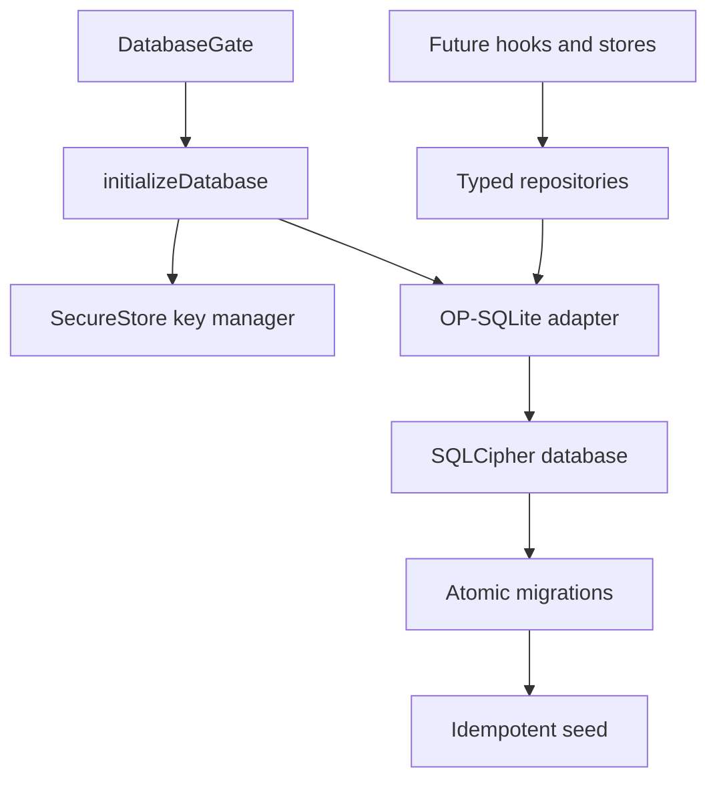

# Task 2 Database Milestone Plan

## Product requirements

### Problem statement

MoneyMap needs a durable, encrypted, offline source of truth before any finance workflow can be implemented. Task 2 establishes that source of truth without adding Task 3 reactive state or later user-facing finance features.

### User stories

- As a student, I want my finance records to remain on my device and encrypted at rest.
- As a first-time user, I want a Cash account and useful student categories ready immediately.
- As a future feature developer, I want typed records, deterministic migrations, and tested CRUD contracts.

### Functional requirements

- Model accounts, categories, transactions, budgets, and recurring rules with integer minor-unit money.
- Create the five tables, required indexes, foreign keys, checks, and the budget uniqueness constraint.
- Apply ordered migrations atomically and idempotently.
- Seed one Cash account and twelve student-focused categories idempotently.
- Expose typed, parameterized CRUD repositories for all five tables.

### Non-functional requirements

- Use OP-SQLite compiled with SQLCipher in an Expo development build.
- Generate a 256-bit database key with a native cryptographic RNG and keep it in Expo SecureStore.
- Reject unsafe JavaScript integers before they can cross the SQLite boundary.
- Make initialization retryable and show an accessible loading or failure state.

### Out of scope

Reactive repository subscriptions, Zustand stores, transaction-entry UI, balances, filters, budgets UI, background rules, import/export, app lock, Smart Tips, and release work remain in their ordered milestones.

## System architecture



The thin repository approach keeps SQL visible and auditable. Parameter arrays prevent value injection, while fixed column allowlists make dynamic updates safe. SQLite B-tree primary keys and indexes provide expected `O(log n)` point access; ordered scans remain `O(n)` in the number of returned rows.

## Data model and trust boundaries

| Boundary | Input | Control |
|---|---|---|
| UI/domain to repository | Typed but runtime-untrusted values | Safe-integer, enum, format, and non-empty validation |
| Repository to SQLite | SQL values | Placeholders only; no user values interpolated into SQL |
| SecureStore to SQLCipher | 64-character hexadecimal key | Strict format validation; invalid stored keys fail closed |
| Migration runner to schema | Repository-owned SQL | Ordered immutable migration registry and transaction rollback |

Financial rows never cross a network boundary in this milestone.

## Project structure blueprint

```text
src/
├── components/DatabaseGate.tsx
├── domain/types.ts
└── db/
    ├── client.ts
    ├── databaseKey.ts
    ├── keyManager.ts
    ├── schema.ts
    ├── seed.ts
    ├── sql.ts
    ├── validation.ts
    └── repositories/
        ├── accountRepository.ts
        ├── budgetRepository.ts
        ├── categoryRepository.ts
        ├── recurringRepository.ts
        ├── transactionRepository.ts
        └── shared.ts
```

## Implementation plan

| ID | Task | Acceptance criterion | Dependency | Effort |
|---|---|---|---|---:|
| DB-1 | Add SQLCipher and secure-key dependencies | Expo config resolves and SQLCipher compile flag is enabled | Task 1 | S |
| DB-2 | Add domain contracts and validation | All model inputs are strict and money values reject unsafe integers | DB-1 | M |
| DB-3 | Add schema and migration runner | Fresh and repeated migration runs reach version 1 atomically | DB-2 | M |
| DB-4 | Add seed routine | Exactly one Cash account and twelve defaults exist after repeated runs | DB-3 | S |
| DB-5 | Add five repositories | Create, read, update, delete, constraints, and FK behavior pass | DB-3 | L |
| DB-6 | Integrate application bootstrap | Navigation renders only after initialization succeeds | DB-4 | S |
| DB-7 | Run QA and update required docs | Full local gate reports `QA_PASSED` | DB-1 through DB-6 | M |

## Milestone roadmap

Task 2 completes the encrypted persistence foundation. Task 3 may then add repository change notifications and Zustand stores. Tasks 4–18 remain blocked until their listed predecessors pass.

## Assumptions and risk register

| Risk or assumption | Impact | Mitigation |
|---|---|---|
| Android is the only v1 release target | iOS SQLCipher is not release evidence | Keep cross-platform types; validate Android dev build |
| Expo Go cannot load OP-SQLite | Developers could see a native-module error | Document and enforce dev-client usage |
| SecureStore data is removed on Android uninstall | A restored encrypted DB would lack its key | Android automatic backup is disabled; Task 12 adds an explicit encrypted backup format |
| Node tests cannot prove native SQLCipher encryption | False security confidence | Treat tests as SQL-contract proof and require an Android unreadability check in Task 14/release QA |
| OP-SQLite Node facade is not the production backend | Test/native behavior can drift | Run tests on real SQLite and add Android prebuild/build validation |
| Deep Windows checkout paths exceed Ninja's object-file limit | Native verification fails before application code compiles | Generate a short, per-checkout CMake staging directory plus an object-path ceiling through an idempotent Expo config plugin |
| OpenSSL Prefab libraries link but are not automatically copied into the APK | SQLCipher crashes before React starts with a missing `libcrypto.so` | Extract each ABI's pinned `libcrypto.so` through an idempotent Expo Gradle plugin and verify the APK entries in native QA |
