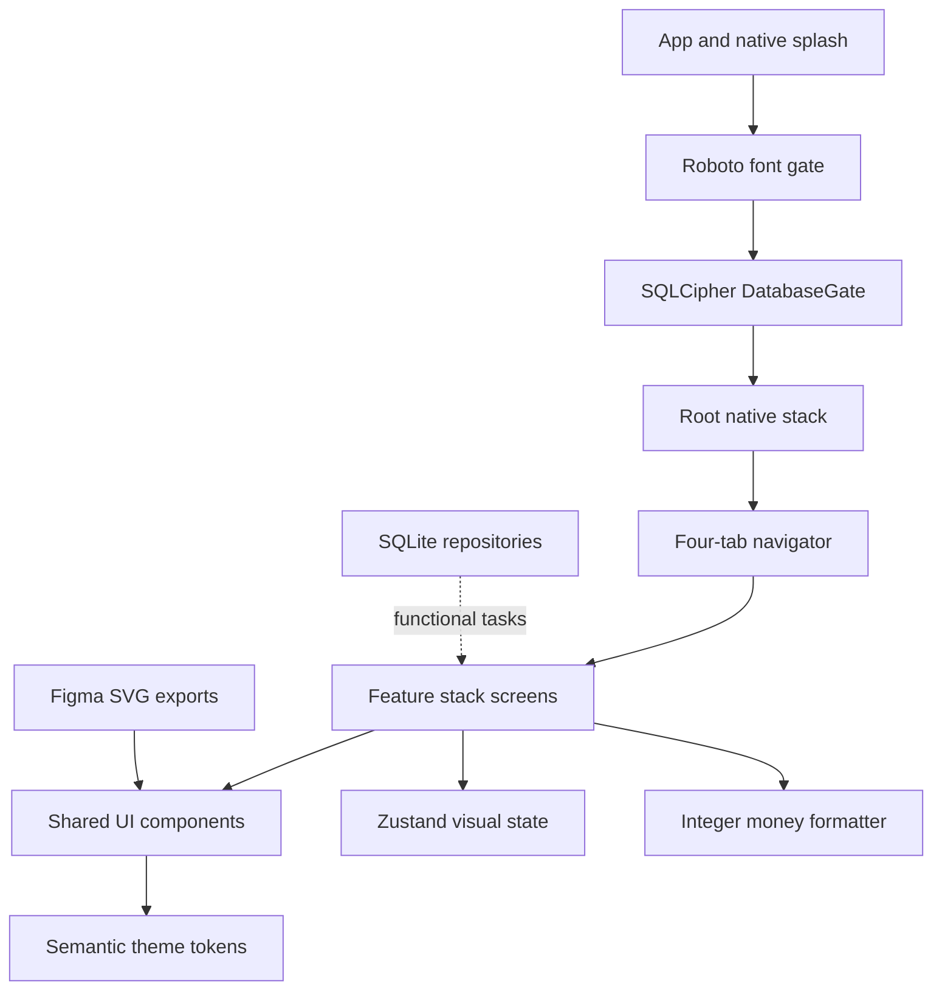

# MoneyMap Figma UI Fidelity Implementation

## Product requirements

### Problem statement

The Expo development build had an encrypted persistence foundation but no production interface. The approved MoneyMap Figma file defines the visual contract for the Android v1 experience and must be represented faithfully without weakening the offline-first, integer-money, or layered-architecture constraints.

### Users and stories

- As a student, I can understand my balance, spending mix, budgets, and latest transactions at a glance.
- As a student, I can reach transaction entry from the dashboard and enter an amount with a touch-friendly keypad.
- As a student, I can inspect history, budgets, recurring reminders, settings, and Smart Tips through predictable navigation.
- As a privacy-focused user, I can see lock and encrypted-storage states without the visual prototype making network calls or persisting fake records.
- As a user with system dark mode enabled, I receive the approved dark dashboard automatically.

### Functional visual requirements

- Reproduce all ten approved Figma frames at a 412 dp design width.
- Preserve a four-tab navigation shell for Home, History, Budgets, and Settings.
- Hide the tab bar only on transaction entry; retain it on nested Smart Tips and recurring-reminder screens.
- Support light and dark semantic palettes, safe areas, scrolling on shorter displays, empty history, toggles, three budget states, and disabled transaction-save state.
- Keep all displayed currency source values in integer minor units and format only at the view boundary.
- Use exact exported Figma SVG geometry for the four navigation icons.

### Non-functional requirements

- TypeScript strict mode must pass without adding `any` to domain or database code.
- Interactive targets expose native accessibility roles, labels, values, and minimum practical touch dimensions.
- Rendering must remain responsive from compact Android viewports through a bounded 540 dp content column.
- The visual Smart Tips fixture must remain offline and contain no `fetch` call.
- Native launch must hold the splash surface until bundled fonts are ready.

### Out of scope for this visual milestone

- Persisting UI preview switches to MMKV.
- Writing transactions, filters, budgets, reminders, or settings to SQLite.
- Requesting notification or biometric permissions.
- Calling Gemini or any other network service.
- Treating fixture-driven screens as completion of later functional tasks in the project specification.

## Assumptions and decisions

- The Figma file title overrides the former placeholder display name, so the Expo app name is `MoneyMap`; the Android package remains the documented placeholder until release.
- The exact 412 by 892 Figma frames are the baseline. Shorter Android windows scroll while retaining the original width, spacing rhythm, and fixed tab geometry.
- Figma shows Smart Tips and reminders switched on. Zustand holds those states only as an in-memory visual fixture; it grants no consent, performs no network request, and does not change the product default for the later functional implementation.
- Roboto Regular, Medium, and Bold are bundled locally through Expo Font, avoiding runtime font downloads.
- Emoji remain system-rendered because the approved frames use emoji as category illustrations; the four navigation icons use exact SVG exports.

## Figma frame map

| Figma node | Implemented view | Route or state |
|---|---|---|
| `7:2` | Dashboard | Home / Dashboard |
| `12:21` | Add Transaction | Home / Entry |
| `12:101` | History | History / HistoryList |
| `13:40` | Budgets | Budgets / BudgetsOverview |
| `13:105` | Settings | Settings / SettingsOverview |
| `15:94` | Dashboard dark | Dashboard with system dark mode |
| `15:204` | App Lock | Root / AppLock |
| `15:245` | History empty | `HistoryBody` with an empty group list |
| `38:134` | Recurring & Reminders | Budgets / Recurring |
| `40:153` | Smart Tips | Home / SmartTips |

## Architecture



### Trust boundaries

- Figma exports are static repository assets and execute no code.
- Screen fixtures are immutable local constants and contain no account identifiers, raw imported data, or secrets.
- The database gate remains ahead of navigation, so the UI fails closed if encrypted storage cannot initialize.
- No network client is introduced; Smart Tips is presentational only.

### State management

- React Navigation owns route and nested-stack state.
- Zustand owns only three ephemeral preview switches.
- Local React state owns transaction-entry amount, selected type/category/account, and PIN preview digits.
- Future repository-backed hooks remain the integration seam for project tasks 3 onward.

## Project structure blueprint

```text
App.tsx                         native splash, fonts, DB gate, navigation theme
assets/icons/                   exact Figma bottom-tab SVG exports
src/
  components/                   reusable primitives, cards, chart, rows, controls
  domain/services/money.ts      integer-only parse and display formatting
  navigation/                   typed root, tab, and feature stacks
  screens/                      ten approved screen/state implementations
  store/uiStore.ts              in-memory visual switch state
  theme/tokens.ts               exact light/dark semantic design tokens
__tests__/                      money, themes, components, and static boundaries
docs/ui-fidelity-implementation.md
```

## Data structures and algorithms

| Concern | Structure or algorithm | Complexity | Reason |
|---|---|---:|---|
| Theme access | Frozen keyed token maps | O(1) time, O(1) fixed space | One semantic source prevents screen-local drift. |
| Money formatting | Integer division, modulo, and digit grouping | O(d) time, O(d) output | `d` is digit count; no floating-point currency arithmetic occurs. |
| Keypad input | Bounded finite-state string update | O(d) time, O(d) output | Enforces one decimal point, two decimals, and a 15-character cap. |
| Donut chart | One SVG circle per segment with cumulative offsets | O(s) time, O(s) nodes | `s` is the fixed category segment count. |
| Screen lists | Immutable ordered arrays mapped to rows | O(n) time, O(n) rendered nodes | Preserves Figma ordering and supports later repository replacement. |
| Navigation | Fixed typed route maps | O(1) route lookup | Compile-time route contracts reject unsupported parameters. |
| Budget progress | Integer percentage clamped to 0–100 | O(1) | Prevents invalid visual widths and exposes an accessible value. |

## Implementation plan and status

| ID | Task | Dependency | Acceptance criterion | Effort | Status |
|---|---|---|---|---:|---|
| UI-01 | Inspect local Node, Java, Android, emulator, Figma, and editor tooling | None | Existing compatible tools are identified before installation | S | Complete |
| UI-02 | Resolve Figma nodes and export approved assets | UI-01 | All ten frames and four icon assets are mapped | M | Complete |
| UI-03 | Install compatible SVG, font, Zustand, and UI-test packages | UI-01 | Expo dependency checks pass | S | Complete |
| UI-04 | Build semantic theme and integer-money services | UI-02 | Exact theme and money unit tests pass | M | Complete |
| UI-05 | Build reusable accessible UI primitives | UI-04 | Component state tests pass | L | Complete |
| UI-06 | Build all screens and nested navigation | UI-05 | Every mapped frame is reachable or directly testable | L | Complete |
| UI-07 | Validate at exact 412 dp width in Android | UI-06 | Live screenshots match frame hierarchy, spacing, and states | M | Complete |
| UI-08 | Add native splash/font handoff | UI-03 | Launch has no missing splash-module error | S | Complete |
| UI-09 | Run full QA and documentation gate | UI-08 | Typecheck, Jest, Expo Doctor/export, Gradle, install, and runtime checks pass | M | Complete |

## Milestone roadmap

1. UI fidelity baseline: complete the approved static and interactive visual layer.
2. Project task 3: connect repository subscriptions and persistent Zustand settings.
3. Project tasks 4 onward: replace fixtures feature-by-feature in the strict dependency order.
4. Release polish: measure cold start, device accessibility, rotation, and signed AAB behavior.

## Risk register

| Risk | Probability | Impact | Mitigation |
|---|---|---|---|
| Android font metrics differ from Figma/CSS | High | Medium | Central `AppText` removes Android font padding and uses bundled Roboto weights. |
| Fabric drops functional `Pressable` style callbacks in this stack | Observed | High | Use deterministic static control styles and enforce the boundary in a static test. |
| Short emulator height clips the 892 dp reference frame | High | Low | Use scroll containers and preserve exact 412 dp width and vertical rhythm. |
| Visual fixtures are mistaken for persisted functionality | Medium | High | Keep fixtures isolated, document the seam, and avoid completion claims for later project tasks. |
| Figma-enabled Smart Tips conflicts with product default OFF | Medium | High | Treat enabled appearance as ephemeral visual state; no consent, persistence, or networking exists. |
| Expo native module and generated Android project drift | Medium | High | Run prebuild, Expo Doctor, Gradle assemble, reinstall, and live launch after native dependency changes. |
| Moderate transitive audit findings are force-fixed into breaking upgrades | Medium | Medium | Report them and avoid `npm audit fix --force`; address dependency families in a controlled upgrade. |

## Visual and accessibility acceptance checklist

- [x] Exact Figma screen hierarchy and copy represented for all mapped frames.
- [x] Four exact SVG tab icons included as local assets.
- [x] System light/dark theme switching verified on Android.
- [x] Safe areas, compact-height scrolling, and bounded wide-screen content implemented.
- [x] Controls expose button, switch, progress, tab, alert, and summary semantics as appropriate.
- [x] Money fixtures use integer minor units; formatter tests cover boundaries and signs.
- [x] Smart Tips contains no direct network call.
- [x] Destructive or persistence actions remain inert in this visual milestone.
